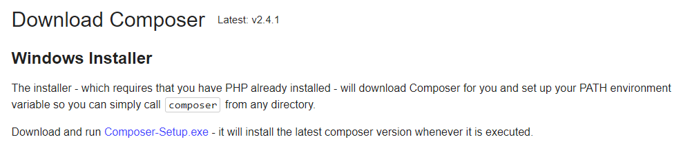
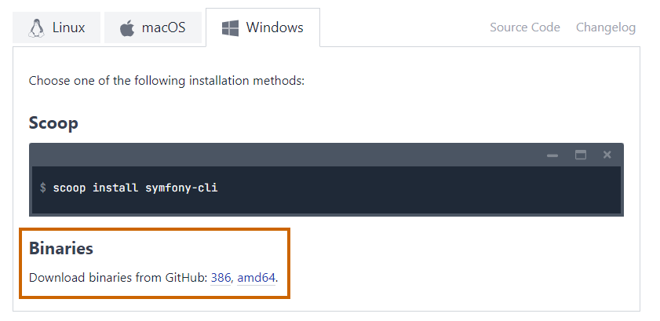
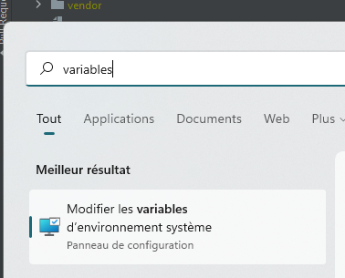
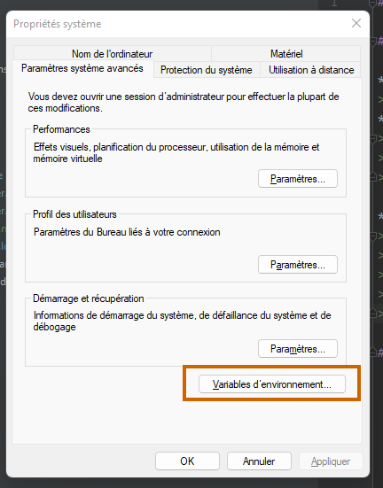
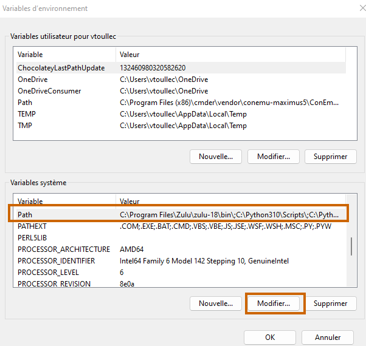
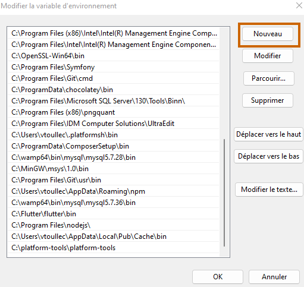
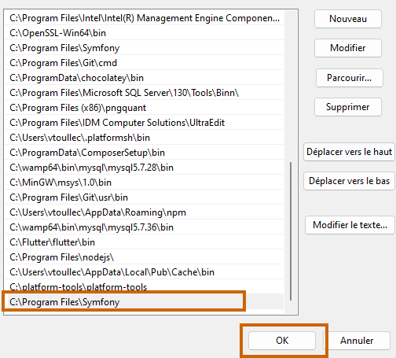

# Symfony

## Pré requis

* Installer un des serveurs locaux suivants : Wamp / Xampp / Lamp / Mamp 
> Contient un serveur Apache + MySQL/MariaDB + PHP
* Installer le gestionnaire de dépendances Composer https://getcomposer.org/download/
> Privilégier le téléchargement du fichier d'installation plutôt que les lignes de commande
>
> 
  
* Installer Symfony CLI https://symfony.com/download
> Privilégier le téléchargement des binaires
>
> 
>
> Extraire le fichier `.zip` dans un dossier système (exemple : `C:\Program Files\Symfony`)
>
> Depuis le menu "Démarrer" Ajouter aux variables d'environnement le dossier dans lequel se trouve `symfony.exe`
>
> 
>
> 
>
> 
>
> 
>
> 

## Installation

* Cloner le repository
* Ouvrir une invit de commandes
